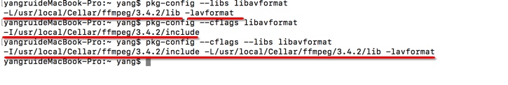
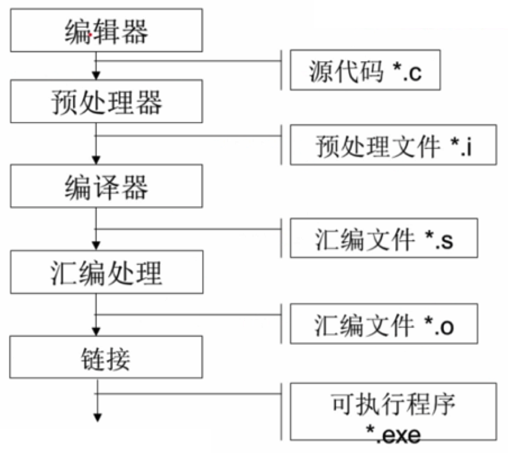
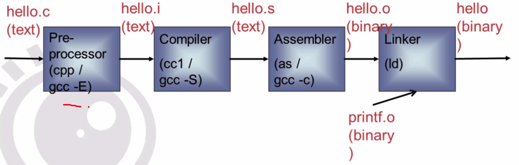

# 一. 编译器的主要组件


## 1. 分析器

分析器将源语言程序代码转换为汇编语言,  因为要从一种格式转换为另一种格式(C 到 汇编), 所有分析器要知道目标机器的汇编语言


## 2. 汇编器

汇编器将汇编语言代码转换为CPU可以执行的字节码


## 3. 连接器

连接器将汇编器生成的单独的目标文件组合成可执行的应用程序.  连接器需要知道这种目标格式以便工作


## 4. 标准C库

核心的C函数都有一个主要的C库来提供. 如果在应用程序中用到了C库中的函数, 这个库就会通过连接器和源代码连接来生成最终的可执行程序


# 二. GCC的基本用法和选项


## 1. GCC 常用选项介绍


- gcc 最基本的用法是: `gcc [options] [filenames]`

  - `-c` : 只编译, 不连接成为可执行文件,  编译器只是由输入的`.c` 等源代码文件生成.  `.o` 为后缀的目标文件, 通常用于编译不包含主程序的子程序文件
  - `-o` :  output filename , 确定输出文件的名称为 output filename, 同时这个名称不能和源文件同名. 如果不能给出这个选项, gcc 就给出预设的可执行文件 `a.out`
  - `-g`: 产生符号调试工具(GNU的gdb) 所必要的符号资讯, 想要对源代码进行调试, 我们就必须加入这个选项
  - `-O` : 对程序进行优化编译/ 连接, 采用这个选项, 整个源代码会在编译/ 连接的过程中进行优化处理, 这样产生的可执行文件的执行效率可以提高, 但是, 比编译/ 连接的速度就要相应的慢一些.
  - `-O2`: 比`-O` 更好的优化编译/ 连接. 当然整个编译/ 连接过程会更慢.
  - `-I  dirname`:  , 将dirname所指的目录加入到程序头文件目录列表, 是在预编译过程中使用的参数.
  - `-L dirname` : , 将dirname 所指的目录加入到程序函数档案库文件的目录列表中, 是在链接过程中使用的参数

  

  

## 2. GCC 示例

- 1. 将src 下的helloworld.c 编译生成helloworld可执行文件, 放在bin目录下

  ```
  gcc -o bin/helloworld   src/helloworld.c
  ```

- 命令置换

  ```
  clang -g -o main main.c  `pkg-config --libs libavformat`
  ```

- Linux中的gcc 或 mac 中的clang命令如下: 

  ```
  gcc   -g  -O2  -o main  main.c  -I /ffmpeg/include   -L /ffmpeg/lib 	-lavutil
  clang -g  -O2  -o main  main.c  -I /ffmpeg/include 	 -L /ffmpeg/lib 	-lavutil
  
  // 上面的两条命令也可以这样简写, 系统会自动导入头文件和库文件
  gcc   -g  -O2  -o main  main.c `pkg-config --libs -cflags -libs libavutil`
  clang   -g  -O2  -o main  main.c `pkg-config --libs -cflags -libs libavutil`
  ```

  上面的2条编译命令, 其用法是一样的, 我们以gcc 的为例说明各个参数的含义即用法

  >
  >
  >`-g`  输出文件中的调试信息, 也就是说编译过程中输出程序的调试信息
  >
  >`-O2` , `o` 是大写的`o` 且`o` 和`2` 之间没有空格 , 表示的是对输出问价做指令优化, 这样程序在执行时速度会变快.  有时在调试程序是,我们会省略这个参数. 
  >
  >说明: 
  >
  >1. 指令优化通常有3中选项: `-O1`/ `-O2`/ `-O3`  其中`-O` 也可以直接写成`-O`
  >2. `-O3` 优化力度> `-O2` 优化力度> `-O1` 优化力度
  >
  >`-o main  main.c` , 其中 `-o` 是小写的`o` 表示指定输出文件, `main` 表示的是输出文件的名字, `main.c` 表示要编译连接的文件, 合在一起的意思是将 `main.c` 编译连接后生成可执行文件`main`
  >
  >`-I /ffmpeg/include` 表示在`ffmpeg/include` 目录下搜索查找`main.c` 中导入的头文件
  >
  >`-L /ffmpeg/lib` 表示在`ffmpeg/lib` 目录中查找`main.c` 中要连接的 静态库文件
  >
  >`-lavutil`  , 前面`-L /ffmpeg/lib`  说明的是一个静态库的存储地方, 里面可能有很多库文件, `-lavutil`  表示说明使用`ffmpeg/lib` 目录下的那个库文件, **注意: 这里使用-l 是小写的, l后面直接是库文件的名字中间没有空格 **  还有就是在linux和mac 中规定静态库命名时的名字必须以 `lib`开头且后缀必须是`.a` , 但是在clang和gcc 中使用`-l` 说明要连接的静态库名时, 要取出前面的`lib` 前缀和`.a` 后缀,  clang和gcc 在查找时会自动添加前缀和后缀查找

  也就是说 `-I` 大写的I后面根头文件目录, 指定头文件搜索范围, `_L` 大写的L 后面跟具体的静态库的存储范围,指定静态库查找范围, `-l` 小写的L , 后面紧跟静态库名不要前缀和后缀说明具体链接的静态库

- 查看 库文件的路径信息

  ```
  // 查看 引入.a文件的路径信息
  pkg-config --libs libavformat
  
  // 查看引入.a的头文件路径信息
  pkg-config --cflags libavformat
  
  // 查看 引入头文件和库文件路径信息
  pkg-config --cflags --libs libavformat
  ```

   

  


# 三. GCC 编译的过程

 


 

- 预处理 

  > 什么是预处理呢? 
  >
  > 预处理就是将C代码中以井号` #`  开头的语句做一个处理(eg:把 `#include<stdio.h>` 引入的头文件展开, 把`#define`宏定义替换 ) , 生成的是 `.i` 文件, 最后生成的`.i` 文件会很大.
  >
  > 此过程中不会做语法检查

  ```
  // 以下指令是预处理C源程序代码, 生成.文件
  gcc -E test.c -o test.i
  ```

- 编译

  > 所谓, 编译就是把 `.i` 文件转换成**汇编语言** 文件 `.s` 文件
  >
  > 在这个过程中会检测语法错误
  >
  > 会根据不同的平台生成不同的汇编语言文件

  ```
  // 以下的命令, 将 .i 文件生成.s 汇编文件
  gcc -S test.i  -o test.s	
  ```

- 汇编处理

  > 汇编语言并不是电脑能直接识别的, 所以我们还要对汇编语言进行处理, 生成机器能识别的二进制目标文件 `.o` 文件

  ```
  // 以下命令, 将 .s 汇编语言转成 .o 目标文件
  gcc -c test.s -o test.o
  ```

- 链接

  > 在我们的项目中, 有多个 `.c` 文件就会生成多个 `.o` 文件
  >
  > 多个`.o` 文件和我们的库文件链接在一起最后生成可执行文件

  ```
  gcc test.o -o test
  ```

  


# 四. 条件编译


```
#define __DEBUG__

void test(){
	#ifdef __DEBUG__
		printf("条件编译, 正常编译");
	#else
		printf("条件编译, 非正常编译");
	#endif
}
```


# 五. typedef

```
#define N 20
typedef struct student {
	int no;
	char name[N];
	float score;
}Stu, *Stup;  // 同时取多个别名
```


# 六. 内存管理


- C/C++ 中定义了4个内存区间:

  - 代码区

    > 专门用于存储代码

  - 全局区

    > 存储所有的全局变量与静态变量

  - 栈区

    > 存储局部变量

  - 堆取


