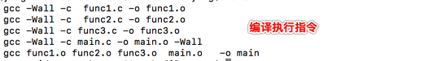
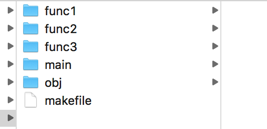
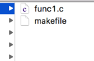
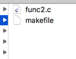
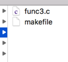
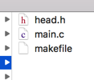
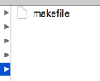

[TOC]


# 一. Make 简介


以前我们写代码的时候`.C文件` 并不多, 一般就3~5个, 且其中只有一个文件中包含main函数. 但是我们在工作中, `.c文件` 是非常多的.  如果在项目中`.c` 文件非常的多, 你想对项目做一个正确的编译, 我们就很想借助一个编译工具, 这个工具一般我们就选择`make` .  `make` 就是我们在写C代码时候用的自动编译工具. 


- `Make`:  工程管理器, 顾名思义, 是指管理较多的文件.
- `Make工程管理器`也就是个`自动编译管理器`, 这里的`自动`  是指它能够根据文件时间戳自动发现更新过的文件而减少编译工作量, 同时, 它通过读入 `Makefile` 文件的内容来执行大量的编译工作.
- `Make` 将只编译`改动过的代码文件` , 而不用完全编译, 减少二次编译的时间开销.

> 一句话, make 就是帮助我们编译复杂项目的一个编译管理工具, 使得编译更简单更高效


# 二. Makefile 基本结构


## 1. **make** 自动编译管理器介绍


- 源文件内容

```
// func1.c 源文件

#include <stdio.h>
void f1(){
	printf("message func1.c\n");
}
```

```
// func2.c 源文件

#include <stdio.h>
void f2(){
	printf("message func2.c\n");
}
```

```
// func3.c 源文件

#include <stdio.h>
void f3(){
	printf("message func3.c\n");
}
```

```
// head.h 头文件
void f1();
void f2();
void f3();
```

```
// main.c 源文件

#include <stdio.h> 
#include "head_0.h"

int main(int argc, char const *argv[]){
	f1();
	f2();
	f3();
	printf("messsage end main \n");
	return 0;
}
```

- 编译命令

```
// 编译连接所有的.c 文件, 
// -Wall选项意思是编译后显示所有警告。例如数据转换之类的警告
gcc *.c -Wall   // 默认的输出文件是 a.out
```

- 以上操作完全是没有问题的, 但是每次都这样编译所有的文件, 文件太多时, 时间就会很长. 所以这时候就出现了**make** 编译工具,  **make** 就是我们经常说的 **自动编译管理器**   , 他可以根据时间戳自动发现更新的文件, 减少编译的文件数量, 减少编译时间. 对于**make(自动编译管理器)** 而言, 它通过读取**makefile** 文件来执行大量的编译工作. 也就是说**makefile** 文件是 **make** 自动编译管理器的一个配置文件, **makefile** 说明了要编译哪些文件

  > 补充说明:
  >
  > **make** 自动编译管理器在编译文件时, 并不是所有的文件都需要编译, 它会自动判断选择要编译的文件. 
  >
  > 一句话: **make 只会编译改动的文件或新增的文件, 不会全部文件都编译** 


## 2. makefile 的基本结构

- **makefile**  是 **make** 读取的唯一配置文件, `makefile` 主要是由三部分组成:

  - **target**:  说明`makefile` 文件的目标是什么

  - **denpendency_files**:  说明`makefile` 文件执行的前提依赖文件有哪些

  - **command**: 说明`makefile` 文件在有了`目标(target)` , 明确了依赖文件`denpendecy_files` 后要执行的命令是什么

    > 注意:
    >
    > 命令行(command)前必须是一个 `tab键` , 否则编译错误提示:`missing separator . stop` 

  只要我们学会了编写 `makefile` 文件, make 自动编译管理器我们就学会了

- **makefile 文件的基本格式**, 示例:

  ```
  # hello.o 是目标target
  # hello.c hello.h 是依赖文件 denpendency_files
  # gcc -c hello.c -o hello.o 是命令行 command
  
  hello.o : hello.c hello.h
  	gcc -c hello.c -o hello.o  # 前面必须要有 tab 键分割
  ```

  > 示例说明如下: 
  >
  > 1. 第一行的 `hello.o` 是 第二行命令 `gcc -c hello.c -o hello.o` 的目标   换句话说, 第二行命令执行的结果就是生成第一行的 `hello.o` 目标
  >
  > 2. 第一行的`:`分号后面 的`hello.c`  和 `hello.h`  是执行第二行命令 `gcc -c hello.c -o hello.o` 的依赖, 即要`hello.c`  和 `hello.h`  这两个依赖文件准备好了后才能执行第二行的命令
  >
  > 3. 第二行命令`gcc -c hello.c -o hello.o ` 的前面必须要有一个 `tab` 键空格, 以示区分
  >
  >    否则报错`missing separator . stop`

- **makefile** 文件编写完成后, 在终端直接执行 **make**  命令, **make** 工具就会自动的读取当前目录下的**makefile** 配置文件, 进行自动编译, 在编译的过程中**make**  会对一个一个的依赖文件进行检查,  所有的依赖都满足就会执行对应的命令. 

  > makefile 文件的第一个字母大小写都可以

- 示例:

  ```
  main : func1.o func2.o func3.o main.o
  	gcc func1.o func2.o func3.o main.o  -o main
  func1.o : func1.c 
  	gcc -Wall -c func1.c -o func1.o
  func2.o : func2.c 
  	gcc -Wall -c func2.c -o func2.o
  func3.o : func3.c 
  	gcc -Wall -c func3.c -o func3.o
  main.o : main.c head.h
  	gcc -Wall -c main.c -o main.o -Wall
  ```

## 3. make 的执行说明


- 当我们在使用 **make** 命令时, 如果后面没有跟 **makefile**  中的具体目标名, 其实**make** 内部是选择执行第一个目标的, 比如我们的`makefile` 书写如下:

  ```
  main : func1.o func2.o func3.o main.o
  	gcc func1.o func2.o func3.o main.o  -o main
  func1.o : func1.c 
  	gcc -Wall -c func1.c -o func1.o
  func2.o : func2.c 
  	gcc -Wall -c func2.c -o func2.o
  func3.o : func3.c 
  	gcc -Wall -c func3.c -o func3.o
  main.o : main.c head.h
  	gcc -Wall -c main.c -o main.o -Wall
  ```

  当我们在终端上执行下面的命令

  ```
  make
  ```

  其实, 相当于是执行下面的命令

  ```
  make main
  ```

- 其实, 我们可以根据 `makefile 文件的书写格式` : **目标**  **依赖文件**  **命令**   在一个`makefile` 中书写很多的执行目标, 但是并不是每个目标都会执行, 当我们只执行`make` 命令时, 默认选择第一个目标执行,  其实我们也可以在执行 `make` 命令时, 在后面明确的指定 目标名, 这样**make 自动编译管理器** 在运行时就会选择对应的目标执行


## 4. makefile 伪目标

有时我们在使用make 命令 , 选择要执行的 目标是, 有可能当前项目中就有一个文件的名字和 `makefile` 中的目标名重名, 这时我们在使用 `make xxx目标是` 就会提示 `xxx目标` 已经是最新的不让这行. 这时我们就可以在`makefile` 文件中添加一个伪目标

```
比如:  在当前目录中有个 文件叫 `clean` ,  我们在编写`makefile文件`时, 有个目标也叫`clean`,   这时我们在执行 `make clean` 命令编译`clean` 这个目标时, 就会提示`clean` 文件已经是最新了,不需要编译.  为了让每次执行 `make clean` 时, 都执行并编译, 我们可以这样书写 makefile 文件, 如下:


main : func1.o  main.o
	gcc func1.o func2.o func3.o main.o  -o main
func1.o : func1.c 
	gcc -Wall -c func1.c -o func1.o
main.o : main.c head.h
	gcc -Wall -c main.c -o main.o -Wall
	
.PHONY:clean # 指定伪目标
clean: 
	rm *.o main
```


>  一句话, 为目标可以让 **make** 命令无条件执行

```
// 在 目标名前面添加 .PHONY:  就可以指定伪目标
.PHONY: clean
clean:
	rm *.o
```


# 三. makefile 创建 & makefile变量


## 1. makefile 中为什么要有变量


- 用来代替一个文本字符串
  - 系列文件的名字
  - 传递给编译器的参数
  - 需要运行的程序
  - 需要查找源代码的目录
  - 你需要信息的目录
  - 你想做的其他事情

>  简单概括: 
>
> 在makefile 中书写的 同一段`依赖文件名`  `依赖目标名` `命令参数` `命令`   可能会被应用在多段makefile指令中, 重复的书写可能一个是很浪费时间, 二个是很容易写错, 三个是不便于统一维护, 因此, 如果我们把这些会重复使用的 `依赖文件名`  `依赖目标名` `命令参数` `命令`   抽成变量, 那在后面我们直接使用定义好的变量代替, 这样书写效率高, 可靠性高, 维护简单


## 2. makefile 中定义变量的方式(两种) 

### 1.方式一, 递归展开式 (name=value) 推荐

#### 1. 递归式变量介绍:


- 格式: 

  > 变量名=变量值

  ```
  foo = $(bar)
  bar = $(ugh)
  ugh = Huh?
  
  问: $(foo) 的值是多少?
  答:  Huh?
  ```

- 补充:

  > 在makefile 中打印内容使用 `@echo` , eg:
  >
  > @echo "$(foo)"

- 递归式的优点

  - 它可以向后应用变量

- 递归式的缺点

  - 不能对该变量进行任何扩展

  > CFLAGS = $(CFLAGS) - 0 会造成死循环

  

#### 2. 递归式变量的拼接


递归式变量的拼接使用 `+=` 符号

- 正确的做法是这样的:

  ```
   AB= $(OBJS)
   AB += $(CC)
   @echo $AB # 输出为: func1.o func2.o func3.o main.o gcc
  ```
  
- 错误的做法:

  ```
  # 定义 makefile 变量 OBJS 和 CC
  OBJS=func1.o func2.o func3.o 
  CC=gcc
  ```

  ```
   AB= $(OBJS) + $(CC)
  @echo $AB # 输出为: func1.o func2.o func3.o main.o + gcc
  ```

  

### 2. 方式二, 简单方式 (name:=value)

- 格式: 

  > name:=zhagnsan

  ```
  m := mm
  x := $(m)
  y := $(x) bar
  x := later
  
  @echo $(x) 
  @echo $(y)
  打印结果: 
  later
  mm bar
  ```

  

## 3. makefile 中变量的使用 (示例)

- 使用makefile 变量之前的代码,如下:

  ```
  main : func1.o func2.o func3.o main.o 
  	gcc func1.o func2.o func3.o main.o  -o main
  
  func1.o : func1.c 
  	gcc -Wall -c func1.c -o func1.o
  func2.o : func2.c 
  	gcc -Wall -c func2.c -o func2.o
  func3.o : func3.c 
  	gcc -Wall -c func3.c -o func3.o
  main.o : main.c head.h
  	gcc -Wall -c main.c -o main.o -Wall
  
  # 清除(删除所有的 .o文件 和 main可执行文件)
  .PHONY:clean
  clean:
  	rm *.o main
  ```

- 使用makefile 变量之后的代码

  ```
  # 定义makefile 变量 
  OBJS=func1.o func2.o func3.o 
  OBJS+=main.o 
  CFLAGS=-Wall -c 
  CC=gcc
  
  # 使用makefile 变量使用要用 $() 包裹
  main : $(OBJS) 
  	$(CC) $(OBJS)  -o main
  
  func1.o : func1.c 
  	$(CC) $(CFLAGS) func1.c -o func1.o
  func2.o : func2.c 
  	$(CC) $(CFLAGS) func2.c -o func2.o
  func3.o : func3.c 
  	gcc -Wall -c func3.c -o func3.o
  main.o : main.c head.h
  	gcc -Wall -c main.c -o main.o -Wall
  
  # 清除(删除所有的 .o文件 和 main可执行文件)
  .PHONY:clean
  clean:
  	rm *.o main
  ```

  


## 4. makefile 中的自动变量

在makefile 中, 我们除了可以自定义变量外, 我们也可以使用一些系统定义好的自动变量, 如下:

- `$*`:  不包含扩展名的目标文件名

- `$+`: 所有的依赖文件, 以空格分开, 并以出现的先后为序, 可能包含重复的依赖文件

- `$<`: **第一个依赖文件的名称** 

- `$?`: 所有时间戳比目标文件晚的依赖文件, 并以空格空格分开

- `$@`: 目标文件的完整名称

- `$^`: 所有**不重复**的 **目标依赖文件** , 以空格分开

- `$%`: 如果目标是归档成员, 则该变量表示目标的归档成员名.

  > 有了对自动变量的认识后, 我们以前的makefile 文件就可以简化了

  ```
  # 定义makefile 变量 
  OBJS=func1.o func2.o func3.o 
  OBJS+=main.o 
  CFLAGS=-Wall -c 
  CC=gcc
  
  # 使用makefile 变量使用要用 $() 包裹
  # 注意: 
  # 1. $^ 只能用来代替 所有的  目标依赖
  # 2. $< 用来代替第一个依赖 (可以是文件依赖也可以是目标依赖)
  # 3. $@ 代表的是完整依赖名
  # 4. 在makefile 中打印使用 @echo "被打印信息", make 只能在target之后, 且前面要有 tab
  
  # 使用$(info " 打印信息")
  
  main : $(OBJS) 
  	$(CC) $^ -o $@
  	@echo "执行main 目标..."
  	@echo "全部目标依赖: $^"
  	@echo "目标名:$@ \n" 
  
  func1.o : func1.c 
  	$(CC) $(CFLAGS) $< -o $@
  	@echo "执行func1.o 目标..."
  	@echo "第一个依赖: $<"
  	@echo "目标名: $@ \n"
  
  func2.o : func2.c 
  	$(CC) $(CFLAGS) $< -o $@
  	@echo "执行func2.o 目标..."
  	@echo "第一个依赖: $<"
  	@echo "目标名: $@ \n"
  
  func3.o : func3.c 
  	$(CC) $(CFLAGS) $< -o $@
  	@echo "执行func3.o 目标..."
  	@echo "第一个依赖: $<"
  	@echo "目标名: $@ \n"
  
  main.o : main.c head.h
  	$(CC) $(CFLAGS) $< -o $@ 
  	@echo "执行main.o 目标..."
  	@echo "第一个依赖: $<"
  	@echo "目标名: $@ \n"
  
  # 清除(删除所有的 .o文件 和 main可执行文件)
  .PHONY:clean
  clean:
  	rm *.o main
  	@echo "执行 clean 目标"
  ```


> 一句话概括, makefile 自动变量是makefile文件简化书写的一种方式


## 5.makefile文件中的环境变量

- **make** 自动编译管理器, 在启动的时候会自动的读取当前系统已经定义的环境变量, 并且会创建与之对应且具有相同名称和值的变量

  > 就是说你在系统中定义了哪些环境变量在makefile中都可以使用, 名字和值一样

- 如果用户在makefile中定义了自定义的变量名和系统环境变量名同名, 那么会覆盖系统环境变量.


## 6. make 运行的一些参数选项

- `-C`:  读取(执行)指定目录下的 `makefile`

  ```
  // make执行时读取a目录下的b目录下的makefile文件
  // make 默认读取的是当前目录下的makefile
  make -C ./a/b
  ```

  

- `-f` : file 读入当前目录下的`file` 文件作为 `makefile`

  > 这个`-f` 参数主要是出于这样的考虑,  我们的源代码在编译时分`debug`版本和`release` 版本,  因为`make` 工具默认指定当前目录下的`makefile`文件, 因此我们的代码默认情况下分`debug` 和`release` 版本编译是不方便的, 所以这时我们可以通过`-f` 参数来指定`make` 工具使用哪个文件作为makefile的编译配置文件

  ```
  make -f makefile_debug  // 使用 makefile_debug 作为make的编译配置文件
  make -f makefile_release  // 使用 makefile_release 作为make的编译配置文件
  ```

  

- `-i`: 忽略所有的命令执行错误

  > `-i` 这个参数其实还是很有用的,特别是在大型项目中
  >
  > 因为 是这样的, 在一个很大的项目中, 我们在编写`makefile` 时难免会出现错误, 比如你在编译一个大项目整个过程可能需要 几个小时, 默认情况下当编译过程中出现一个小错误就会编译就会终止, 后面的编译工作没法进行了, 但是我们实际的开发不可能总是因为一些小的错误浪费整个编译时间吧, 这时我们就可以在编译是使用 `-i` , 表示在编译过程中如果出现错误就暂时忽略继续编译后面的文件, 这样起码能保证绝大部分的文件编译完成,  当编译完成后我们在使用去掉 `-i` 参数的方式检查编译, 这样时间就节约了

  ```
  make -i // 忽略可能出错的编译, 继续后面的编译
  ```

  

- `-I`: dir 指定被包含的`makefile` 所在目录

- `-n` : 只打印要执行的命令, 但不执行这些命令

  > 这个参数其实也是很有用的, 有时我们的工程可能很大, 不可能一下子全部编译, 为了查看一下我们的一个编译大概过程, 这时我们可以使用`-n` 来模拟一下编译过程, 看一个大概

  ```
  make -n  // 模拟编译, 查看编译过程
  ```

   

  

- `-p`: 显示`make` 变量数据库和隐含规则

- `-s`: 在执行命令时不显示命令

- `-w`:  如果`make` 在执行过程中改变目录, 打印当前目录名


## 7. makefile 外部变量

### 1. makefile 引入外部变量原因

是这样的, 在很小的项目开发中, 一个makefile文件就足够了, 完全没必要使用外部的makefile变量的, 在一个makefile文件中书写即可满足要求, 但是当我们的项目达到一定的规模后, 特别是一个大型的项目分成了很多的大模块之后, 比如说: `ffmpeg` 源码项目在开发的过程中就是分成了很多的大模块, 各个模块可能都是由不同的团队在开发的, 这时每个模块就会有自己的makefile文件, 可以支持单个模块编译, 但是从全局来考虑, 一个大的项目中的有些编译参数对个各个团队都应该是一样的, 这样从上至下才有统一的编码规范, 所以就需要把共性的编译配置参数抽取出来单独写在一个文件内, 其他团队引用这个共性文件达到上下统一的目的


### 2. 定义makefile外部变量

- 很简单, 就是将makefile中定义的变量单独写在一个文件中即可

  ```
  // mfile 文件定义makefile变量
  
  # 定义makefile 变量 
  OBJS=func1.o func2.o func3.o 
  OBJS+=main.o 
  CFLAGS=-Wall -c 
  CC=gcc
  ```


### 3. makefile文件中使用外部变量

- 在makefile文件中使用 `include` 引入外部文件即可

  ```
  //makefile 编写make配置
  
  # 使用include 引入外部变量
  include mfile
  
  main : $(OBJS) 
  	$(CC) $^ -o $@ 
  
  func1.o : func1.c 
  	$(CC) $(CFLAGS) $< -o $@ 
  
  func2.o : func2.c 
  	$(CC) $(CFLAGS) $< -o $@ 
  
  func3.o : func3.c 
  	$(CC) $(CFLAGS) $< -o $@ 
  
  main.o : main.c head.h
  	$(CC) $(CFLAGS) $< -o $@  
  
  # 清除(删除所有的 .o文件 和 main可执行文件)
  .PHONY:clean
  clean:
  	rm *.o main
  	@echo "执行 clean 目标"
  ```

### 4. 运行 make, 读取makefile配置文件

- 使用 `make` 命令即可:

  ```
  make
  ```


# 四. makefile 虚路径 (VPATH)


## 1. makefile 虚路径(VPATH)介绍

### 1. 为什么要使用makefile 虚路径(VPATH)? 


在一些大的工程项目中, 有大量的源文件, 我们通常的做法是把这些文件分门别类的放在单独的目录内, 这样项目的文件更有层次感便于维护.  所以当`make` 需要去寻找相应的依赖文件时, 你可以在对应的文件前面加上目录路径. `(即描述依赖文件时需要使用全路径描述,否则make找不到依赖文件)`, 这样做`make` 能够正确的编译并生成正确的文件没问题, 但是, 如果我们在编写项目代码的时候, 其中某个文件修改了目录或是被添加到了一个新的目录, 我们就需要对应的修改`makefile` 依赖文件的描述, 这就给我们的工程带来了极大的维护成本.  最好的办法就是我们通过一个规则或者方法告诉`make` 工具, 你可以去哪个或哪些目录查找依赖文件, 让`make` 工具自己去查找, 我们只要告诉它依赖文件的名字即可, 这就是为什么我们要使用**makefile 虚路径 VPATH**的原因


### 2. makefile 中的虚路径(VPATH)

在makefile文件中有个特殊的变量**VPATH** 变量,  这个变量就是用来指定**make** 查找依赖文件目录的变量. 如果没用在makefile 文件中指明查找依赖文件的目录,那么默认情况下make只会在makefile所在的目录查找对应的依赖文件.  如果指定了**VPATH** 变量, 那么make除了会去makefile当前的目录查找还会去**VPATH** 指定的目录查找. 

- **VPATH** 变量的格式

  > VPATH = dir1:dir2:dir3...
  >
  > 一个VPATH变量(虚路径), 可以指定多个查找目录, 多个目录之间使用`:` 分号隔开, 这和系统的环境变量定义是一个规则

### 3. makefile 中使用虚路径(VPATH)

```
//在 ./func1目录下有个func1.c
//在 ./func2目录下有个func2.c
//在 ./func3目录下有个func3.c
```

- 我们的makefile可以这样写:

  ```
  
  # 定义makefile 变量 
  OBJS=func1.o func2.o func3.o 
  OBJS+=main.o 
  CFLAGS=-Wall -c 
  CC=gcc
  
  # 有了这句, 我们在编译时make就可以自动在这几个目录下自动查找了
  # 依赖关键可以在这几个目录下随意放了
  VPATH=func1:func2:func3
  
  
  
  main : $(OBJS) 
  	$(CC) $^ -o $@
  	@echo "执行main 目标..." 
  
  func1.o : func1.c 
  	$(CC) $(CFLAGS) $< -o $@
  	@echo "执行func1.o 目标..." 
  
  func2.o : func2.c 
  	$(CC) $(CFLAGS) $< -o $@
  	@echo "执行func2.o 目标..." 
  
  func3.o : func3.c 
  	$(CC) $(CFLAGS) $< -o $@
  	@echo "执行func3.o 目标..." 
  
  main.o : main.c head.h
  	$(CC) $(CFLAGS) $< -o $@ 
  	@echo "执行main.o 目标..." 
  
  # 清除(删除所有的 .o文件 和 main可执行文件)
  .PHONY:clean
  clean:
  	rm *.o main
  	@echo "执行 clean 目标"
  	
  # 清除当前目录下的所有.o文件(删除所有的 .o文件 和 main可执行文件)
  .PHONY:clean-all
  clean-all:
  	find ./ -name "*.o" -exec rm {} \;
  	@echo "执行 clean-all 目标"	
  
  ```

- 

  - 查找当前目录下的所有`.o` 文件

  ```
  find ./ -name "*.o"
  ```
  


# 五. makefile 的嵌套


## 1. 为什么要有makefile 的嵌套呢? 

 在我们大型的项目中, 源文件经常是分模块编写开发, 各模块有自己的makefile文件, 我们称为子模块makefile, 可以用于单独编译子模块. 在子模块外面有一个外层makefile文件, 用于编译整个项目. 当我们使用外层的项目makefile文件时, 它会自动的依次调用子层的makefile文件, 当每个子模块的makefile文件编译完成并连接好后,最终的一个项目就编译好了, 这就是为什么有makefile的嵌套了

> 一句话, makefile嵌套就是makefile分层管理. 


## 2. makefile 的嵌套使用

### 1. 文件目录结构划分

- 当前目录下文件如下图:

   

  

- func1目录

   

- func2目录

   

- func3目录

   

- main目录

   

- obj目录

   


### 2. 各目录下makefile 文件内容

- 最外层makefile文件

  ```
  CC=gcc
  # 子模块目录, 每个子模块下面有一个makefile 文件
  SUBDIRS=func1 \
  		func2 \
  		func3 \
  		main  \
  		obj
  # 子模块, 目标依赖名
  OBJS=func1.o func2.o func3.o main.o
  # 存放.o 文件的目录
  OBJS_DIR=obj
  
  # 可执行文件的名称
  BIN=myapp
  # 存放二进制可执行文件的 目录
  BIN_DIR=bin 
  
  # 导出变量
  export CC OBJS BIN OBJS_DIR BIN_DIR
   
  all:CHECK_DIR $(SUBDIRS)
  
  # 检查并创建 bin目录
  CHECK_DIR:
  	# mkdir -p 是递归创建目录, eg: mkdir -p c/d 如果c 不存在, 会先创建c 再创建d
  	mkdir -p $(BIN_DIR)
  
  # 一次读取子 makefile文件编译子模块, 之前先打印要编译的子模块
  $(SUBDIRS): ECHO
  	# make -c 读取指定目录下的 makefile 文件
  	# 此处相当于是依次执行 SUBDIRS 下的makefile 文件
  	make -C $@
  
  # 依次打印要编译的子模块
  ECHO:
  	@echo $(SUBDIRS)
  	@echo begin compile
  
  .PHONY:clean-all CLEAN
  CLEAN:
  	# 删除所有的 .o 文件
  	# RM  是系统预定医德一个变量实际就是 rm -f
  	@$(RM) $(OBJS_DIR)/*.o
  	# 删除二进制可执行文件
  	@rm -rf $(BIN_DIR)
  
  # 其实外层的makefile 没有做什么事情, 主要的是起到一个流程控制
  # 一层层的调用 子目录下的 makefile
  ```

  

- func1目录下makefile文件内容

  ```
  # 整个makefile 文件的含义上将 func1.c 生成 func1.o 并放在 上一级的obj目录下
  # ../$(OBJS_DIR)/func1.o 是目标文件
  # 这里表示的是上一层的obj 文件, 也就是说生成的 .o 文件放在上一级的 obj 目录下
  ../$(OBJS_DIR)/func1.o:func1.c
  	# $^ 表示的是所有不重复的 目标依赖文件 , 以空格分开
  	# $@ 表示的目标依赖文件的全名, 此处等价于 ../obj/func1.o 
  	$(CC) -c $^ -o $@
  ```

  

- func2目录下makefile文件内容

  ```
  # 整个makefile 文件的含义上将 func2.c 生成 func2.o 并放在 上一级的obj目录下
  # ../$(OBJS_DIR)/func2.o 是目标文件
  # 这里表示的是上一层的obj 文件, 也就是说生成的 .o 文件放在上一级的 obj 目录下
  ../$(OBJS_DIR)/func2.o:func2.c
  	# $^ 表示的是所有不重复的 目标依赖文件 , 以空格分开
  	# $@ 表示的目标依赖文件的全名, 此处等价于 ../obj/func2.o 
  	$(CC) -c $^ -o $@
  ```

  

- func3目录下makefile文件内容

  ```
  # 整个makefile 文件的含义上将 func3.c 生成 func3.o 并放在 上一级的obj目录下
  # ../$(OBJS_DIR)/func3.o 是目标文件
  # 这里表示的是上一层的obj 文件, 也就是说生成的 .o 文件放在上一级的 obj 目录下
  ../$(OBJS_DIR)/func3.o:func3.c
  	# $^ 表示的是所有不重复的 目标依赖文件 , 以空格分开
  	# $@ 表示的目标依赖文件的全名, 此处等价于 ../obj/func3.o 
  	$(CC) -c $^ -o $@
  ```

  

- main目录下makefile文件内容

  ```
  # 整个makefile 文件的含义上将 main.c 生成 main.o 并放在 上一级的obj目录下
  # ../$(OBJS_DIR)/main.o 是目标文件
  # 这里表示的是上一层的obj 文件, 也就是说生成的 .o 文件放在上一级的 obj 目录下
  ../$(OBJS_DIR)/main.o:main.c
  	# $^ 表示的是所有不重复的 目标依赖文件 , 以空格分开
  	# $@ 表示的目标依赖文件的全名, 此处等价于 ../obj/main.o 
  	$(CC) -c $^ -o $@
  ```

  

- obj录下makefile文件内容

  ```
  ../bin/myapp: $(OBJS) 
  	$(CC) $^ -o ../bin/myapp
  	@echo "执行obj makefile " 
  ```


### 3. 嵌套makefile文件的执行顺序

当指定最外层makefile 文件后, 根据依赖的检测顺序, 会依次执行

-  `func1 中的makefile文件 `  生成 ` func1.o`
-  `func2 中的makefile文件`  生成 ` func1.o`
-  `func3 中的makefile文件 `    生成 ` func3.o`
-  `main 中的makefile文件`  生成 main.o`
-  `obj 中的makefile文件` 链接 `func1.o` `func2.o`  `func3.o` `main.o` 生成 `myapp` 二进制可执行文件存储在 `bin` 目录中.


